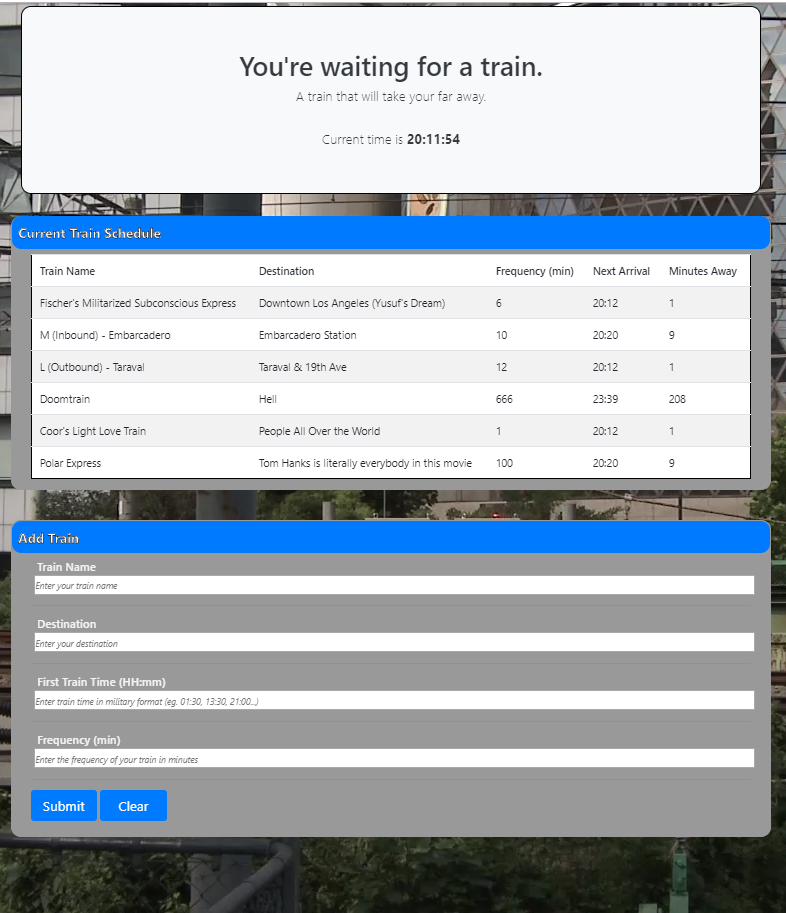

# Train-Scheduler
This is an assignment for the UC Berkeley Coding Bootcamp in which the main focus was to learn to utilize and apply Google Firebase as a realtime database for storing and obtaining data to be utilized on a webpage as well as the application of the Moment.js library to in order to parse, validate, and manipulate dates and times within Javascript.

In this project, I created a function train scheduler that allows the user to input information on a train (fictional or not) and then be presented with relevant information as to that train's arrival times, frequency, and time until the next arrival.

---
## Technologies Used
* HTML
* CSS
    * [@Bootstrap](https://getbootstrap.com/) CSS Library
* Javascript
    * [jQuery](https://jquery.com/) Javascript Library
    * [Moment.js](https://momentjs.com/) Javascript Library
* Google [Firebase](https://firebase.google.com/)
* Git